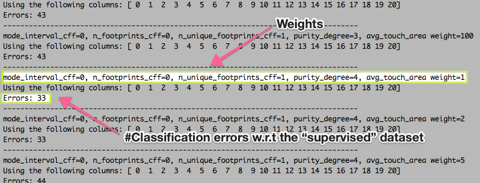
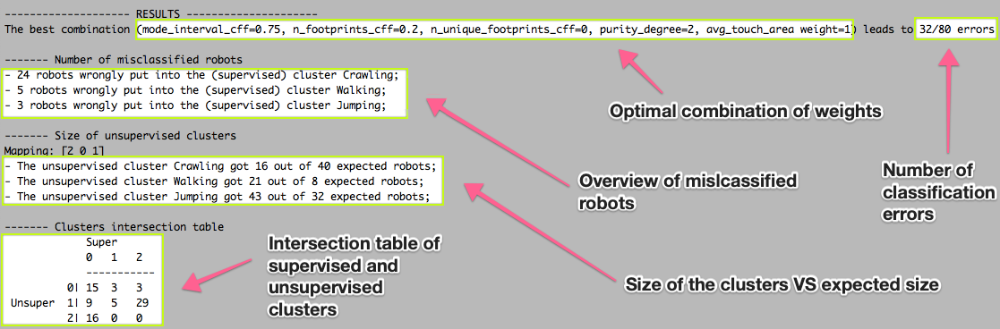

# vsr-behavior-characterization
In this small project we apply an Unsupervised Learning technique (`KMeans`) to find
recurrent behaviors in a dataset of Voxel-Based Soft Robots (VSR).

## Structure of the project
The folder `src` contains the core of the project, in particular the file
`behavior_classification.py` is responsible for the execution of the
experiments. The other files are auxiliary functions/classes used to clean
the code.

The folder `dataset` contains the data which we arw willing to clusterize.
`best.[0-9].txt` contain the predictors on which we apply KMeans, please refer to
[this](https://medvet.inginf.units.it/teaching/2122-intro-ml-er/project/#vsrs-behavior-characterization)
webpage for an overview of their meaning. The files `supervised_clusters*.py`
contain two different versions of verification datasets that we prepared by
hand via the manual inspection of videos available alongside the datasets.

## Example run and output
Navigate to the root folder of the project (you should see both `src` and
`dataset`). To run an experiment, use the following command

```python
python3 src/behavior_classification.py N
```

where `N` is the desired number of clusters. Note that at the moment we support
only `N=3` and `N=4` since these are the only values for which we managed to
generate two supervised datasets "by hand", in which we classified the behavior
of the robots according to our opinion. This allows us to select the best
combination of the weights we introduced in our approach (and which we wish to
optimize in order to obtain improved results). Therefore, new supervised
datasets are needed to increase the domain of `N`. Have a look at the files
`dataset/supervised_clusters*.py` to see how we represented the supervised
clusters.

The script tries a wide set of possible values for the weights, and for each
combination produces the following output:


This first step may last up to one hour, depending on your device. When all the combination have been tested, an ouput similar to following is printed (we set `N=3` for this example):


As you can see you receive immediately a clear overview of the results for the optimal combination, along with an in-depth comparison between supervised and unsupervised clusters (i.e. clusters built "by hand" and clusters built by the algorithm `KMeans`).

## Authors
+ Francesco Andreuzzi
+ Luca Filippi

## Implementation details
We coded the experiment using Python, along with the scientific libraries NumPy and scikit-learn.

## References
1. Ferigo et al. 2021, *Beyond body shape and brain: evolving the sensory apparatus of voxel-based soft robots.*
2. Hastie, Tibshirani, Friedman, 2009, *An introduction to statistical learning.*
3. Medvet et al. 2020, *Design, validation, and case studies of 2d-vsr-sim, an optimization-friendly simulator of 2-d voxel-based soft robots.*
4. Medvet et al. 2021, *Biodiversity in evolved voxel-based soft robots.*
5. Panday et al. 2018, *Feature weighting as a tool for unsupervised feature selection.*
